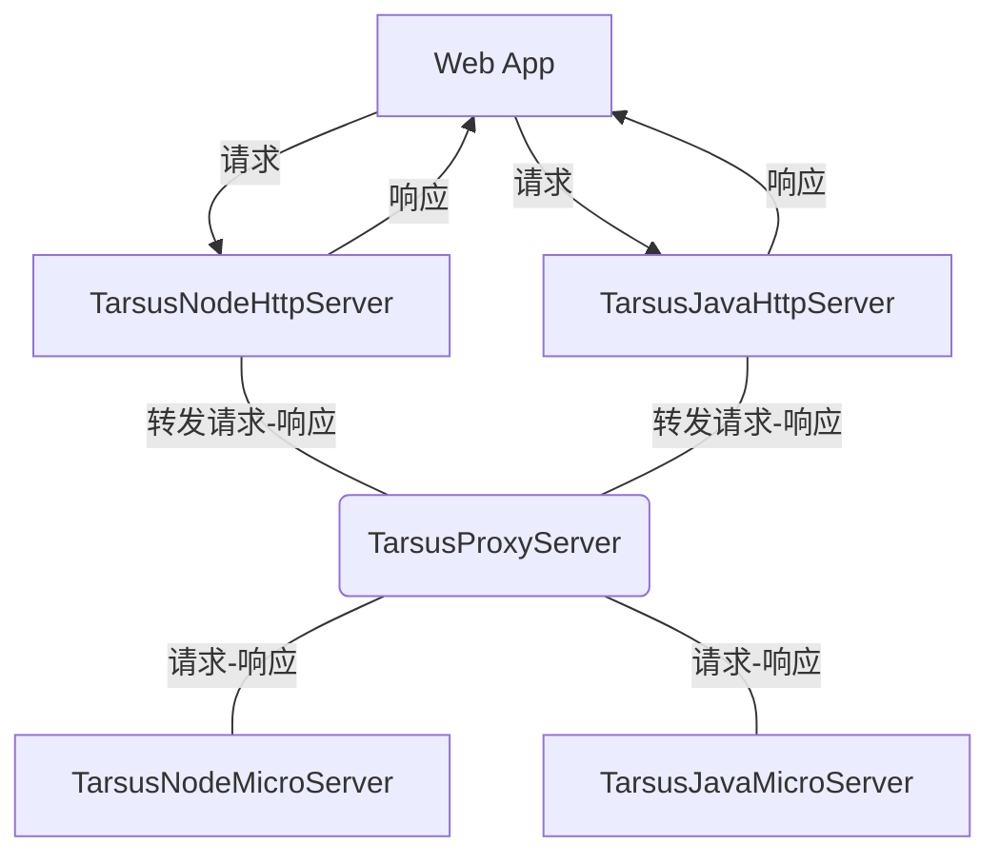

# @Tarsus/Java 微服务模块

## 整合的仓库
- [@Tarsus/Node](https://github.com/chelizichen/Tarsus) 包含 Http服务  微服务模块 依赖注入 ORM 命令行 等多个开发包的库
- [@Tarsus/Java-Proxy](https://github.com/chelizichen/Tarsus-Java-Proxy) SpringBoot，可以提供Http 服务，也可以调用微服务
- [@Tarsus/Java](https://github.com/chelizichen/Tarsus-Java) Java 微服务模块 示例代码

## 微服务架构模型



## Doc

### BaseClass
- Class TarsusBaseServer
- @Decorator TarsusServerApplication (port:int)
- 启动Java服务所需的基类和注解
````Java
@TarsusServerApplication(port = 9811)
public class com.tarsus.dev_v2_0.0.TarsusServer extends TarsusBaseServer {
    public static void main(String[] args) {
        com.tarsus.dev_v2_0.0.TarsusServer c = new com.tarsus.dev_v2_0.0.TarsusServer();
        final Hello hello = new Hello();
        final Test test = new Test();
        c.boost(com.tarsus.dev_v2_0.0.TarsusServer.class);
    }
}

````

- @Decorator @TrasusInterFace(interFace:String) 提供远程调用的接口名
- TrasusBaseInterFace 每个远程调用的接口类需要继承的父类
````Java
@TrasusInterFace(interFace = "HelloInterFace")
public class Hello extends TrasusBaseInterFace {

    @TarsusMethod
    public ret TestRet(@TarsusParam("Person") Person p1, @TarsusParam("Job")Job j1){
        System.out.println("Job Name is ->"+j1.JobName);
        return ret.success(p1);
    }

    @TarsusMethod
    public ret say(String args1,String args2){
        HashMap<String, String> hmp = new HashMap();
        hmp.put("d",args1);
        hmp.put("f",args2);
        ret success = ret.success(hmp);
        return success;
    }
}

````


- @Decorator @TarsusMethod
- 定义改方法为 RPC—Method

````java
//  define

@Retention(RetentionPolicy.RUNTIME)
@Target({ElementType.METHOD})
public @interface TarsusMethod {
}

````

- @Decorator @TarsusParam ( ParamsName:String )
- 将特殊的类型注册，在序列化的时候可以自动创建类
- 在反序列化创建类的时候自动为成员变量赋值

````java
// define
@Retention(RetentionPolicy.RUNTIME)
@Target({ElementType.TYPE,ElementType.PARAMETER,ElementType.CONSTRUCTOR})
public @interface TarsusParam {
    String value();
}

// Hello.java 
// 在定义RPC方法的时候注册相关参数
@TarsusInterFace(interFace = "HelloInterFace")
public class Hello extends TarsusBaseInterFace {

    @ArcMethod
    public ret TestRet(@ArcParams("Person") Person p1, @ArcParams("Job")Job j1){
        System.out.println("Job Name is ->"+j1.JobName);
        return ret.success(p1);
    }
}

/**
 * @since 2023.2.17
 * 废弃 ArcSort 注解
 * 需要手动调用 构造函数(List<String> list) 来为成员变量赋值
 */
@TarsusParam
public class Job {
    public String JobName;
    public String JobCompany;
    public Job(List<String> list) {
        this.JobName = list.get(0);
        this.JobCompany = list.get(1);
    }
}


````
### IOC
- 依赖注入模块(IOC)
- @Decorator @Collect
- @Decorator @Inject
````java
// usage >>
// 注册服务

@Collect
public class HelloService {
    public void sayHello(Job j1){
        System.out.println("cout this jobName >> "+j1.JobName);
    }
}

// usage >>
// 注入服务
@TarsusInterFace(interFace = "HelloInterFace")
public class Hello extends TarsusBaseInterFace {

    @Inject
    HelloService helloService;

    @ArcMethod
    public ret TestRet(@ArcParams("Person") Person p1, @ArcParams("Job") Job j1) {
        helloService.sayHello(j1);
        return ret.success(p1);
    }
}

````

````cmd
>>> cout this jobName >> 测试
````


### ORM
- @Decorator @Column(String db_field_name)
- @Decorator @Entity(String TableName)
- @Decorator @Key
- @Decorator @Keyword
- BaseClass AdoBaseOrm 

**必须使用手动声明无参构造，可用 Lombok 的 @NoArgsConstructor**
 
**使用 @Entity 注解的类也会被收集依赖，可使用 @Inject 实现依赖注入**

目前已支持的方法
- getList(String page, String size)
- getList(String Keyword, String page, String size)
- getOneBy(String value)

````java
@Entity
@NoArgsConstructor
public class Drug extends TarsusBaseOrm {
    @Column
    @Key
    public String id;

    @Column("dr_name")
    public String DrName;

    @Column("dr_price")
    public String DrPrice;

    @Column("dr_remark")
    public String DrRemark;

    @Column("dr_code")
    public String DrCode;

    @Override
    public String toString() {
        return "Drug{" +
                "id='" + id + '\'' +
                ", dr_name='" + DrName + '\'' +
                ", dr_price='" + DrPrice + '\'' +
                ", dr_remark='" + DrRemark + '\'' +
                ", dr_code='" + DrCode + '\'' +
                '}';
    }
}

````

- nodejs 调用
- run command ->> node index.js
````js
var net = require('net')

let server = net.createConnection({
  'host': "127.0.0.1",
  "port": "9811",
})

server.write(`
[#1]HelloInterFace
[#2]say
[#3]3000
[#4]36
[##]
#a#1#b#2#c#3#z#
[#ENDL#]\n
`, function (err) {
  if (err) {
    throw err
  }
})
    
// 测试TestRet方法的字符串    
`
[#1]HelloInterFace
[#2]TestRet
[#3]3000
[#4]36
[##]
#a##a#tom#b#jump#c#12#d#1#z##b##a#测试#z##c#1#z#
[#ENDL#]\n
`
````
